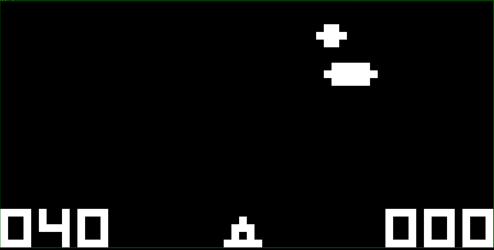
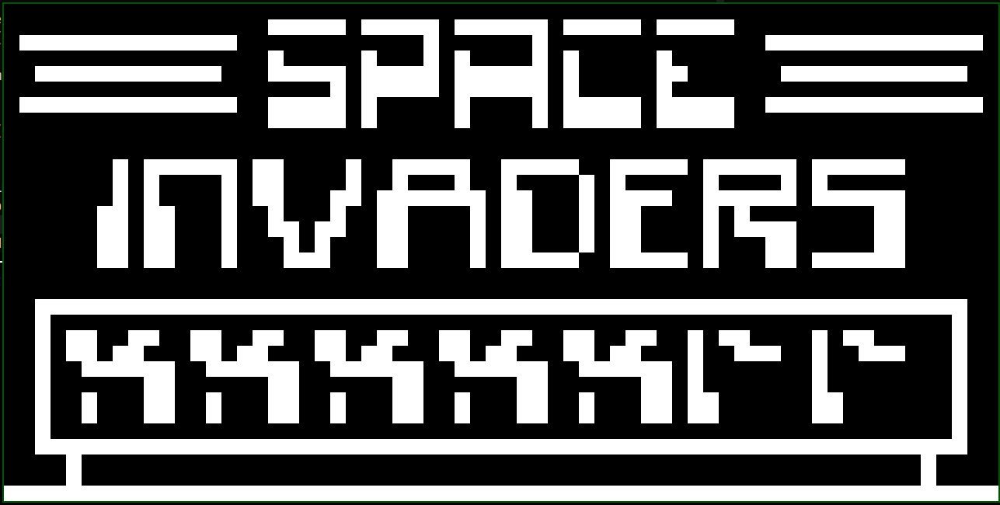

## CHIP-8

> CHIP-8 emulator with SDL graphics

This is a very basic [CHIP-8](https://en.wikipedia.org/wiki/CHIP-8) emulator written in Zig using SDL for graphics. It's still buggy, but can already be used to play some games

Playing UFO:

Playing Space Invaders:

You can find more games [here](http://www.pong-story.com/chip8/).
